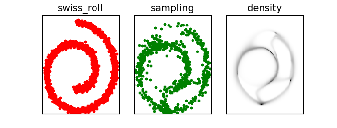
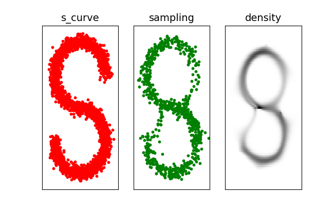
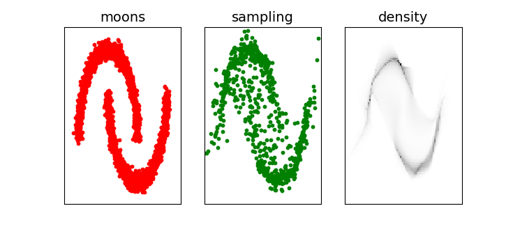

# Density Estimation and Anomaly Detection with Normalizing Flows

This is a PyTorch implementation of planar and radial flows as described in
[Variational Inference with Normalizing Flows](https://arxiv.org/abs/1505.05770) (authors: Danilo Jimenez Rezende, Shakir Mohamed)

Parameters are trained with plain MLE rather than variational inference. This is made possible by explicitly inverting the flows using closed-form inverse functions. To that end, `h(x)=tanh(x)` is replaced with `h(x)=1/(1+|x|)` with no change to the paper's reparametrization trick.

### Scikit-learn's Toy Datasets

| *Radial flows* |
|:--:|
|  |

| *Radial flows* |
|:--:|
|  |

| *Planar flows* |
|:--:|
|  |

### Anomaly Detection

Invertibility makes it easy to compute the likelihood of arbitrary data points. Caveat: vanilla radial and planar flows are transformations from *R<sup>d</sup>* to *R<sup>d</sup>* (*d*: input dimension) that don't scale well to high dimensions. See [Sylvester Normalizing Flows](https://arxiv.org/pdf/1803.05649.pdf) to overcome this limitation.

dataset | IForest precision@k | Anoflows precision@k | dimensions
------------ | ------------- | ------------- | -------------
banknote | 86.3% | 99.4% | 4
forest covtype | 5.1% | 1.3% | 10 (continuous features only)
gamma telescope | 58.9% | 59.2% | 10
mammographic | 75.6% | 76.7% | 4
occupancy | 90.1% | 84.9% | 5
shuttle | 63.3% | 70.5% | 8
wine quality | 17.1% | 11.6% | 11
avg | 56.63% | 57.66% |

HPO disabled.
Look at the YAML files in `benchmarks/` for details about datasets and benchmark setup.

Run `cd benchmarks && python3 eval.py <dataset>.yml` to reproduce the benchmarks.

### Prediction Speed

###### Normally distributed 8-dimensional data

* 15 planar flows: 447,201 rows / second
* 15 radial flows: 295,458 rows / second
* Isolation Forest: 44,735 rows / second

### Dependencies

* python >= 3.5 (tested: 3.6.7)
* torch >= 1.0 (tested: 1.0.1.post2)
* numpy >= 1.14 (tested: 1.16.2)
* tqdm >= 4.26, not mandatory but recommended (tested: 4.31.1)
* scikit-learn >= 0.20.3, only for benchmarks (tested: 0.20.3)
* pandas >= 0.23, only for benchmarks (tested: 0.24.1)

######  Installation instructions

`python3 setup.py install --user`
or
`sudo python3 setup.py install`

If that went well, open up a Python shell and verify the install:

```python
from anoflows.hpo import find_best_flows
```

<!---
#### keywords

density estimation, normalizing flows, anomaly detection, outlier detection, novelty detection, pytorch, neural network
-->
